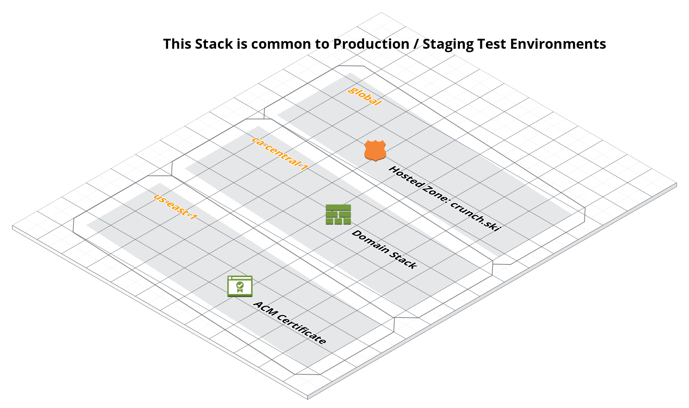
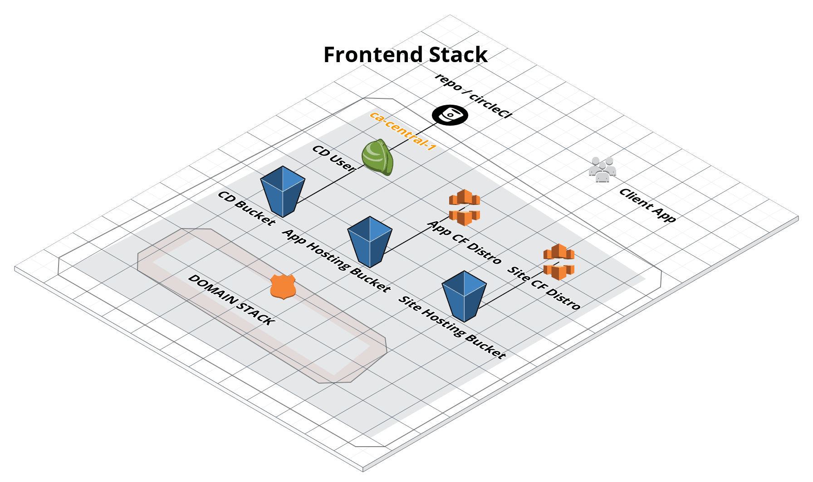
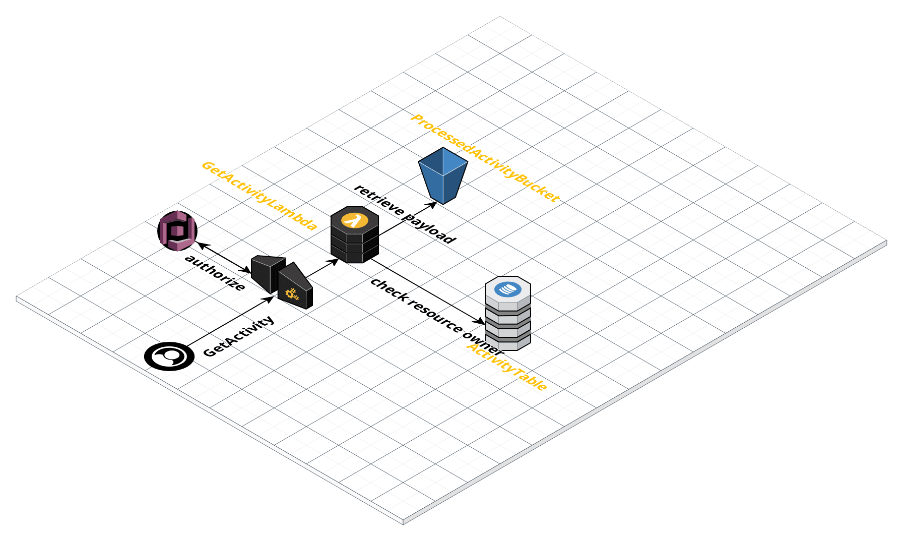
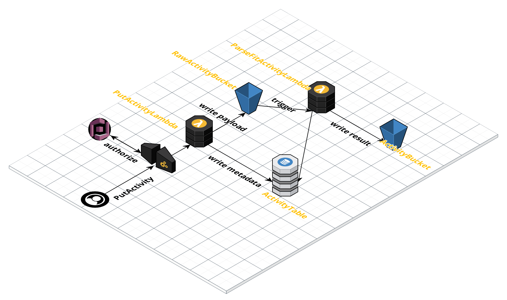

# Project

## High level overview
  This project is a serverless backend for the crunch.ski application.  It provides a 
  set of services to upload, transform, process and store gps track / heart rate data to 
  support a web based analysis tool.  Currently it handles FIT files from garmin / suunto
  devices.  In the future planning to create a watchOS and IOS application to capture data.
   
## Setup
   see [setup.md](setup.md)   
   
## Architecture
  This project is built on the serverless.com framework and AWS.  The majority of AWS 
  resources are scripted as cloudformation templates, although there is some outstanding
  work required to make these stacks fully automated.  
  See [cloudformation polyfills](cloudformation_polyfills.md) for details.
  
  Typical serverless frontend for the web application is also included in this project: S3, 
  cloudfront and CD tools for front end projects circleCI.
  
  Processing services and API use both API Gateway / Lambda and a planned AppSync GraphQL
   endpoint that will be used.  Service code is written in Java / Scala, with gradle build 
   tool.
  
- 3rd Party Components
- Diagramming: [cloudcraft.co](http://cloudcraft.co)
- FIT parsing library [garmin](http://www.thisisant.com/resources/fit/)
- Weather service [darksky.net](http://darksky.net)
- Location service [locationiq.com](http://locationiq.com)

## Build / CI / CD

Each stack is individually deployable.  serverless tool is used to deploy stacks:
`sls deploy` Wrapper scripts `buildDeploy.sh` written for modules requiring compilation.

Currently have not spun up a prod stack

### Stack dependencies

- Domain Stack <- Frontend Stack
- Domain Stack <- Auth Stack <- API stack
- Auth Stack <- GraphQL Stack (`TODO move user table to graphql stack)`
 

## Module / Stacks
### Domain Stack
Notes on domain setup [here](domain_setup.md) 

### Front End

####Production
crunch.ski: main website

app.crunch.ski: application

####Staging 
staging.crunch.ski: main website

staging-app.crunch.ski: application

### Auth
Authentication using Cognito Userpool.  Email signup verification required. 
Email setup is totally manual - no cloudformation stack.  See [email_setup](email_setup.md)

### GraphQL
AppSync GraphQL endpoint for reading / writing non binary
data to user and activity tables.

## API
### Endpoints
#### /Activity
GET /activity/{id}  returns a binary Activity protobuf object

PUT /activity/   currently takes a binary FIT file and returns the activity id

#### Processing workflow

After the raw activity has been saved to the RawActivityBucket, the ParseActivityLambda
is triggered.  This performs the following steps:
1. parse raw .fit file into a temporary data structure `ActivityHolder`
2. runs the processing pipeline
3. converts the `ActivityHolder` into a protobuf `ActivityOuterClass.Activity`
4. modifies the protobuf to add data from 3rd party services, location, weather, etc
5. updates processing status in activity table and writes initial values for any user 
editable fields here.
6. writes protobuf to ProcessedActivityBucket.
7. todo -> trigger a websocket callback to the client indicating that the activity is
ready 

#### Code Structure

ski.crunch.activity.processor contains the core of the business logic.  This package
is thus stable, and should not depend on any other packages.

ski.crunch.activity.parser -> responsible for parsing device data (currently only .fit) 
into temporary structure

ski.crunch.activity.service -> contains cloudnative services for performing business logic
This is currently tied to API Gateway request /response

ski.crunch.utils -> candidate for adding to a Lambda layer so can be used easily in 
other functions

#### Activity data structure 
 `Meta` information not directly related to activity
 
 `UserData` not serialized to protobuf. will be pulled from activity table
 
 `Summary` contains summary statistics for the activity
 
 `Values`  contains raw values for each data series.  Each series is stored 
 as an array.  Can guarantee that each array will be of the same size.  
 `-999` used as a placeholder where no data is available.  Attempts will be
 made by the processor to interpolate missing values if appropriate.
 
 
 ` FitEvent` list of events and their index (deprecated)
 
 `Session` list of sessions.  Typically there will be 1 session per activity
  but this structure allows for multi-sport activities.  Stores activity type,
  session start / stop.  Also stores summary related to this session.
  
 `Segment pauses`  list of pause segments.  start / stop and summary
 
 `Segment laps` list of lap segments.  start / stop and summary
 
 `Segment stops` list of stop segments. start / stop and summary
 
 `Segment activitySegment` seems redundant TODO -> review